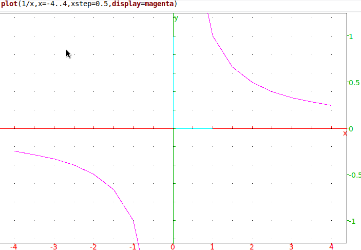
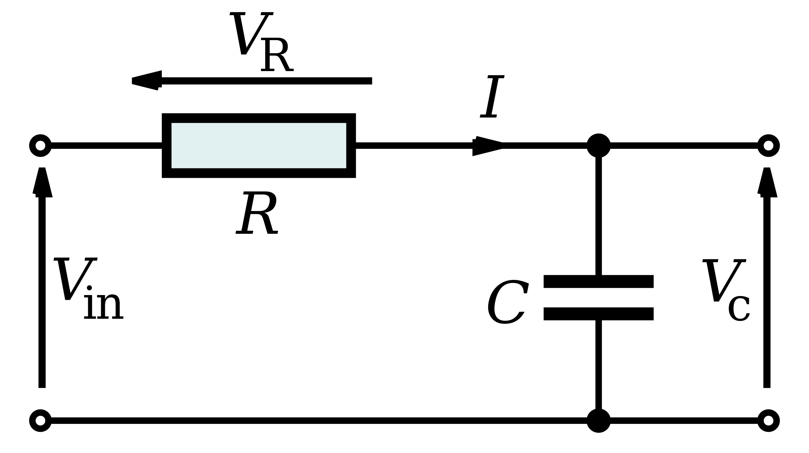

# Math: Explain it like I'm 5

Inspired by a subreddit. All the math that someone
with no math talent knows and uses without actually understanding,
and the facts that people who actually knows math seem to think are "too obvious"
to write down.

None of the fundamentals and excercises I never learned. You
should probably go actually learn math. 


Alpha quality! Hasn't been fully reviewed!


## Variables: Who put letters in the math?

Variables are placeholders, usually a letter or a word, for something you don't know yet.

Often they the "Inputs and outputs" of a formula, allowing you to state an equation that describes something general,
even if you don't know the specific numbers you will need to input until, you actually measure them.

I think they are also like the english "So and so" for an unknown person,
or "Such and such" for and unknown thing, which someone might use when making aan abstract,
general statement that isn't about any particular person, but *is* about people in general.

They are often a single letter, but can also be words or symbols.

## Notation

In math, you can multiply things just by putting them next to each other. 2A means "two times whatever A is".  However, programming languages don't use this syntax,
and calculators need you to explicitly say which function you are using, so in this guide I will be using the explicit conventions, as that is what this stuff looks like in real
life for most people. 

## Arithmetic

This deals with the basic operations like addition and subtraction.  I have no reason to doubt
the teachers who say that learning this is essential for understanding the 
concepts. I will leave such discussions of education to them.

Perhaps if I somehow found time to learn it, I'd be making six figures
in a chemistry lab, rather than writing this!

But in any case, it is rather uncommon to need to calculate something
while you are away from a smart phone, so for the purposes of getting by
without actually understanding it, this is entirely a computer's job.


### Programming

Variables in math are not the same as variables in
programming.   In math, X=70 is a statement that the two are equal,
in most programming languages, X=70 is a command to store the number 70
in the container called X, which can later be overwritten with something else.

They are often not really similar to inputs and outputs, but closer to scratchpads
when you can store things.    In addition, in some languages, they don't truly represent
storage locations at all, and are actually labels you can attach to objects, which can have 
multiple labels, to "be stored in different places at the same time".

Pure functional languages have a concept of variables that is much closer
to the mathematical meaning.

### Graphs

When graphing something, the Y or vertical position is usually the dependant variable,
because we are studying how it goes up and down as we move from left to right(The horizontal position is usually called X, 
and is usually the independent variable, because it's doing it's own thing, we increase it evenly as we go across the chart to see what happens).

Often the independent variable is time, and the vertical axis represents how something changes over time.

There are all sorts of other charts that may use different meanings for each axis, this is just a very common convention.


Note that "Graphs" are also a completely different kind of object studied in Graph Theory
In this case a Graph is basically a bunch of connected nodes, like cities with roads
going between them.  There are many kinds of graphs out there with many computer science applications.


## [Linear](https://en.wikipedia.org/wiki/Linear_function_(calculus)) and Nonlinear functions

This will come up a whole lot.  For any function that takes a number as
an input and returns another number, some will be linear, and others will not.

Linear functions make a straight line if you graph the input vs the output.
Linear functions behave similarly at any scale, the same size input step makes the same size output step, no matter what the value was.When dealing with a nonlinear function, you might find:

* Audio distrotion. Linear functions won't add new frequencies to sound.  Crunchy electric guitar like stuff is nonlinear.

* Thresholds.  Stuff won't behave the same at different power levels, file sizes, or whatever.  Even with no literal sharp cliff like threshold, in practice there may be obvious points where things act different.
* Some nonlinear functions will have huge changes for small steps past a certain point.
* Diminishing returns.  Some nonlinear functions will take more and more input for the same amount of output change.

When dealing with linear functions in things you can directly perceive, like light, it probably won't
look linear, because eyes and ears don't have a linear response.  Brightness generally has a diminishing returns type curve, it
takes more power to look twice as bright the higher you go.

There is usually no way to stack different linear functions with addition to get something nonlinear. This is related to the fact
that no combination of resistors will introduce nonlinearity(In theory, real resistors do wierd stuff with tempeature changes).


## Multiplicaton

## Linearity

A constant times X makes a linear graph.  X times X is the same as X\*\*2, which is most 
definitely not linear.

### Rectangles
Multiplying the lengths of the sides of something gives the square area.  4ft\* 8ft= 32 square feet.  1ft\* ft=1 square foot.

#### Algorithm Complexity 
This also means that any algorithm like "Do something with every possible pair of one input from the list A and one from B" will take an amount of time proportional to the length of A times the length of B, since every step in the algorithm is one of the "Square feet" in the "table" where each side has one foot per item on the list.

If A and B are the same, then the area will be A squared, and this is fairly common in programs. If you see this pattern, maybe try to do something about it, because it will get very slow.

Example: You have 100 items, and you want to display a statistic like "This is more expensive than 99% of items".  If you loop over every one, and compare it to all the others, you will do 100 * 99 comparisions.

Instead, you could pass the full list to a proper sorting algorithm(Which uses code I don't understand to sort things much faster than comparing every element to every other), and simply look at how high up everything is on the list.  The second item costs more than 1% of items and less than 98%.

### Scaling and Gating

It can also make things bigger or smaller. x \* 0.5 is half of something, x \* 2 is twice that thing.  Because it is linear, 
doing this to an audio signal will not distort.

Multiplying by zero is always zero, like a closed gate letting through 0% of what tries to come in.

It's easy to imagine it as a door that only "lets through" a certain fraction.

### Negative numbers

Multiplying by a negative number inverts. 5 times -2 is -10. -5 times -2 is 10.  This is useful in signal processing.

## Percents

Percents are pretty much multiplication. 10 percent of
50 is the same as 0.10 times 50. 200% of 50 is the same as 2.0 \* 50.

Note that there are 100 percent steps, and 100 steps
of 0.01 between 0 and 1, which is why this works.  

You're just dividing the percentage by 100, to get the ratio.  

This also means that percentages are reversible, because multiplication is.

10 percent of 50 is 5.  50 percent of 10 is also 5. Many times
the reversed version is easier to mentally calculate, if for some unlikely reason you don't
have your phone.

As an aside, some math people will insist this is very
obvious, but like most of the stuff in this file, I only know because
of some random Facebook meme.

### Percentage Point Confusion Fun Times

These are a very common way to confuse people. Suppose has a vote to decide what color to paint the school. Yesterday, green got 10 votes in a preliminary poll, or 1%, and today, it has 2% approval.

There are three different ways to report this.  One is to say it increased by one percentage point.  Which is correct.  However, a you could also shorten that to "it increased by one percent", which would not be correct at all.

You could say it has "200% of yesterday's approval", or you could say it had a "100% increase", as those 10 votes it gained are 100% of yesterday's total.

Making raw data available will disambiguate this confusion, as can adding redundancy.  If I say "out of 1000 students, 1%(10 students) preferred green yesterday.  Today 20 students did, a 100% increase!", then you can see for yourself what is actually happening.

Of course, in real science, words are used more precisely, and people are usually expected to know what they mean.  But in everyday writing, this stuff is well known to be confusing.


## Averaging

The most common kind of average is the mean.  To take the mean, you add all
the number together, and decide the result by the count of numbers you added.

When you take the mean of 2 numbers, the result you get will be halfway between the two.

## Averaging in groups vs all at once

If you average numbers in groups, then average the averages,
the result is not always the same as averaging all the numbers in one big average.

For that to give the same result every time, the number of elements of all groups has to be the same.

This is one of those "The internet seems to agree it's true" things I have no explanation for.

This also apparently trips up and confuses people analyzing data,
and could even be used to intentionally mislead people.

## Weighted Averaging

Sometimes you want to give any to give certain values more "weight" than others.

One way to do this, is to multiply every number by it's weight, add them, then divide by the
sum of all the weights.

This essentially makes "extra copies" of the numbers that are "most important" in the average.

Dividing by the sum of weights is pretty much the same as dividing by the total count of items, 
except we account for the "extra copies" we added.

This technique will be important later,when we look at game theory and gambling.

## Moving average

To smooth out a graph, one can "slide" a window across it.

At every step, we take the average of the points in the window, and add that point to our new,
smoothed graph, in the same place as the window's center, or perhaps in the same place as the start or
end in other applications(Such as in realtime, when you can't see the future).

Stock traders like to do this, but from what I hear, they can't actually predict the market as well as
they think.  But you might use it to far better effect, for analyzing the trend of a
water level in a lake, while ignoring short term variations.

Sometimes one even combines the moving and weighted average, and gives more weight
to points closer to the end or center of the window.

I believe that in certain configurations, the "exponentially weighted average" is equivalent to the first order filter we
discuss later.  The first order filter has the advantage of being very easy to implement and very fast.

## Division

### Relation to Multiplication

Multiplying by 1/x  is the same as dividing by x.  Multiplying by x will "undo" dividing by x, and give you
the original number back, and vice versa, dividing can "undo" multiplication by the same number.

But division by a variable does not produce a linear plot.

12 divided by 6 is 2.  12/3 is 4.   When we have half the divisor,
we get double the output. It seems like this should result in a linear chart,
to someone (like me!). without a real understanding of math.

But if one plots 1/x on a graph, the result is not linear.  I don't actually
know why.  It is important because there is no way to implement division
by an arbitrary value with just multiplication, although you can implement division by
one specific value by multiplying.

This is important because many very small cheap chips don't
have hardware division, and multiplication is much faster, so
you may want to watch out for equations involving dividing by a number
that can change.

#### Fig. 1: Plot of 1/x, not a straight line at all.


### Negative numbers

5/-1 is -5.  I don't think I've ever seen division by a negative in real life. It is confusing.

### [Division by zero](https://en.wikipedia.org/wiki/Division_by_zero)

This is not usually a thing that can be done, except in some wierd algebra thing where you
figure out a result indirectly, maybe.


Computers will generate NaN, not a number, infinity, or just raise an error.
Whenever you are dividing by X, where X is the product of some kind of algorithms, be sure it will not ever be zero,
if you don't want your system to crash.

The reason this makes no sense is pretty simple.  Normally, when you divide by a number, you can multiply it by
the same number to get the original. But there is no standard real number than, when multiplied by zero,
gives something other than zero. Multiplying by zero is like an "off switch" that doesn't let anything through.

Clearly, if division by zero had a defined result, it can't be a regular number, and still work in
the way we might expect division to work.

It kind of reminds me of when physicists say that information cannot be destroyed.
To divide by zero would remove the information about what the original number was, but preserving
that information is part of what we accept as "division".

## Exponentiation 

2\*\*5 means "Two times itself five times, or 2\*2\*2\2\*2". It is also said as
"Two raised to the power of five" or "to the fifth power" or similar.

It is sometimes also written as 2^5, but that symbol is also used for other things occasionally, in programming,
so I will use Python's notation, with two stars, to represent exponentiation.

Numbers which can be written as 2\*\*something are powers of two, the first few of which are:
1, 2, 4, 8, 16, 32, 64, 128, 256, 512,1024, 2048, 4096, 8192

These numbers are extremely common when dealing with computers, and numbers that are
two to some other power of two(2\*\*8=256, 2\*\*4=16, etc) are especially common.

The number of possible combination of N binary bits is 2\*\*N.

### Squaring

X\*\*2 is Squaring, as mentioned before, and it gives you the
area of a square, if X is the length of the sides.

To go backwards, and get length from an area, one would use a square root.

x\*\*3 is cubing.  It gives you the volume of a cube given the length of it's edge.


### X\*\*1
Anything to the one, is itself. Five times itself one time, is just 5.

### X**0

Any number raised to the power of 0, is 1, except possibly zero in some cases(see below!)

I am sure there's a cool math reason for this, but it
also happens to be really convienent in programming.


### 0**0

I have no idea what is going on here.  Android calculator thinks it
is "Undefined, or 1”.  That probably means you shouldn't rely
on it to do something sane in programming languages if you don't specificaly check the spec.
 
Xonsh/Python however, just says 1, so your milage may vary on that one.

I have never seen this in real life, or thought of it before just now, and it doesn't seem to really make any sense.
But it is good to know that it 

### Non integer powers

You can raise something to the power of 1.5, just like you can raise it to 2 or 3 or any other integer! But keep in mind, the result will not be halfway between x\*\*1 and
x\*\*2.  If it were, it would not make the same nice continous curve the exponential functions make.

In reality, raising to any number is just as valid as raising to an integer, the only difference as far as I know,is that integers can be explained as "X times itself Y times", but there is probably some deeper mathematical phenomena underlying it all which explains the values in between more completely.

The oversimplified explanation however, is that the values in between follow the same curve you would expect them to, from looking at the integer powers, rather than following a "curve" made of straight lines.  For example, 1 to the 1.5 is not halfway between 1**1 and 1**2.


## Order of Operations

When evaluating a mathematical statement, the order
you do the steps in matters.

This order, in the usual notation, is PEMDAS, parentheses,
exponentiation, multiplication and division, addition, subtraction.

Therefore, to calculate 4*7+8, you do the multiplication first, then the addition.

If we wanted to do the addition first, we would use parentheses, (1+2)*3 is nine, because
we first add the two in parentheses to get three, then multiply by three.

I believe that when you have a whole entire expression as a superscript for exponentiation,
you do that entire sub-expression first, as if it were in parentheses.

When using computers, of course, programming languages don't use superscripts to denote
exponents, but it may be relevant when reading documentation.

## In Programming

Programming languages *mostly* follow this order as well, but some ancient ones do not, and non-mathematical
operations also have their own place in the order, which may be slightly different between languages.

However, programming is not quite the same as math, reliability and clarity matter more than creating any kind
of compact logical statement.

Often the individual sub-operations in an expression result in things that are meaningful in their own right.

In addition, as we will see later, many calculations can be done by automatic solvers.

Therefore, in some cases, you may find:
```
pricePerBox=priceEach*itemsPerBox
totalPrice=pricePerBox*boxes
```

To be more clear than:
"price=priceEach*itemsPerBox*boxes"


In this example, many programmers would prefer the latter,
but some might choose the former, and the former approach gets more and more
appealing with larger expressions.

Real mathematicians may put a high value on compactness and see
and additional content as distractions.  But for practical use, it is up to you
to choose wisely what should be spelled out, and what should just be implied,
for maximum clarity, taking into account those who will read it 

## RPN

Reverse Polish Notation is another way of expressing math, but it is not that common.

In RPN, the operation comes after the numbers.   Numbers are placed on a stack, and operations do something with that
stack.

`2 2 3 + *` means:

* Place 2 on the stack, then put 2 on top, then 3
* The + means: take the top two numbers off the stack, add them, and put the result back.
* Now we have a 2  that was on the bottom, and the 5 we got from the addition of 2 and 3
* Finally, the * takes both off the stack, multiplies, and leaves us with a 10.

I am told it is very nice, simple, and logical, and people seem to love the programming languages
based on this concept.  It is certainly extremely easy for a computer to parse, and has value
on very small chips, but other than that I have a very hard time seeing the value.

I'll leave the debate on which is better to the mathematical minds that value compactness, and pure "expressive power",
but in practice, you probably won't find this kind of thing unless you seek it out.

It is, however, a very interesting insight into how an algorithm can be represented.

Note the fact that it is completely unambiguous, no parentheses are needed, there is no
order of operations, yet you can always specify exactly what you want to do.


## Base systems

### Base 10
Base 10 is when each digit has 10x the value of the last. `437`= four hundreds, three tens, and seven ones, or, more concisely, 
`4*100 + 3*10 + 7*1 `

As a note, the multiplication by one at the end is does nothing, anything times one is just the number you started with, but in programming things are sometimes writen more verbosely to make the intent clear, although mathematicians may see it as unnecessary clutter.

The number of combinations of an N digit lock is 10\*\*N, or "Ten raised to the power of N", meaning ten times ten, repeated N times(See Exponentiation).

For three digits, you start with ten choices for the first.

For every possible choice, there are ten more choices, giving 100 total.

For each of those 100, there are now 10 choices for the final number, giving 1000 total.

Note that a real three digit number only goes up to 999, although there are a thousand possibilities, 
because zero is the first possibility.

This fact causes massive numbers of errors in programming, when people get confused by it.  They are generally known as a type of off-by-one error.

### [Base 2(Binary)](https://en.wikipedia.org/wiki/Binary_number)
Base 2 aka binary is the same thing with 2s. `1111`= one 8, one 4, one 2, and one 1

Since they look the same, in programming we mark binary literals with 0b, as in: `0b11` = 3 = 2+1

The number of possible combinations of N bits, is always 2**N, or 2 times itself N times.

### Base 16(Hexadecimal)

Hex is the same, but with 16 values, 0 through 15 and, we use ABCDEF for the extra numbers. We mark hex with 0x(I don't know why). `0xFF` = 15\*16 + 15\*1 = 255 = the max number you can fit in a byte.

Now because four bits has 16 possible combinations(2 to the 4), we can use one hex digit(having 16 possible vals) to represent four bits.
This means we can use two hex digits for 8 bits, which is a byte, which makes hexadecimal very useful for binary data.

### Base 64
This is normally represented as ASCII text, and in the usual applicaion, is a little more complicated because
64 combinations only represents 6 bits, and bytes work with 8, meaning we must stufff three bytes into 4 characters, 
and in some cases special padding rules apply to the decoders.

Nonetheless, it is the same as the other base systems.

### Non-integer bases
These exist, but I am not going to pretend to understand them.


## Logarithms

The log of a number x, in a given base, is the number you would need to raise the base to the power of, in order to get x.

If y=log10(x), than x=10\*\*y.

Logs are always in a base, usually logn, the natural logarithm, using
the mathematical constant e, log10, or log2.

They are distinct from square or cubic roots, in that a square root
asks "What number, when raised to the two, gives me X", wheras a base 2 logarithm
asks "What number would I have to raise 2 to, to give X".

If you're raising X to the Y, a log finds Y, but a root finds X.


### Use in implementing multiplication

A slide rule is a calculator that amounts to two rulers, that slide.

It's easy to see how you could make an adder this way, but not obvious how one
would multiply.

Logarithms have the neat property that the log of a\*b, is the same as the log of b plus the log of a.

Essentially, if one has a table of logarithms, and "antilogarithm" to convert back,
one can multiply by looking up the numbers in the table, adding, and converting back.


Obviously, nobody really does this anymore, but the property is still a very important
fundamental thing that finds use elsewhere. In fact, there are still computers
that can add much faster than they can multiply.


Interestingly, before logarithms and slide rules, a much more complicated thing called
(https://en.m.wikipedia.org/wiki/Prosthaphaeresis) was used, which involved a set of identities
or equations that let one approximate things involving multiplication, by adding and subtracting
the results of sines and cosines.

The technique was used by astronomers, who previously had to use "Long multiplication" for this purpose.

### Count the Zeros!

Adding a zero to a decimal integer multiplies by ten.  Logarithms can count those zeros. log10(10) is 1
log10(100) is 2, etc.

1,10, 100, etc, are known as the "powers of ten" just like
1,2,4,8 are the powers of two.  Written in binary, the powers of two would be 1, 10, 100, etc,
so the "zero counting" concept still holds.

Note that log10(50) is much farther than the halfway point of log10(10) and log10(100) than
you would think.  It is a nonlinear curve, and linear interpolation and halfway points won't tell you much
about it. 

### Complexity theory

Some advanced algorithms are known to only get slower with the log of the input.

People like these, because as we can see in the zero counting argument, the slowdown eventually
levels off, as it takes a lot of points added on to add a single zero to
a very large number(And thus add another linear step to the running time).


Think of how much you have to add to 1000000000 to get 10000000000. 

It is a lot!


These are actually better than linear time, which means they probably don't
do something to every input, and instead skip some.  If we did something
with every input, unless there's a large fixed overhead that doesn't change with the input, we would usually
expect twice the input data to take about twice as long to handle.

More commonly, you see things that scale with N log N, or N times the logarithm of N.
Not sure why that seems to show up so much.   It seems to be common in advanced algorithms
like the fast fourier transform, and other things that seem(to me) to be based on some Real Hard Math.

## Sine waves

sin(x), when graphed, makes a sine wave. Those waves 
are a pure frequency, but only if infinitely long.

Any finite wave has the "Clicks and pops" of the starting and ending, but in
practice, some waves are thought of as pure tones.

Any repeating periodic sound or RF pattern or any other wave you can plot on a graph,
can be made of different stacked sine waves
of different frequencies, powers, and offsets.

Figuring out what waves go into something is what a Fourier Transform does.

Inverse Fourier Transforms can calculate a waveform given the "ingredient" sine waves.

Most kinds of nonlinear functions (Like vaccum tube distortion!) will add new frequencies not in the input.
This will sound audibily distorted, and interfere with the operation of various circuits that might be interpreting it.

Sine waves also have something I don't understand to to with circles and trigonometry.

### Sampling

If you are taking digital samples of a signal, and you sample slower
than twice the frequency of the highest sine wave, you get aliasing,
which causes the familiar illusion where helicopter blades go backwards,
and which can make a sawblade under fluorescent light stand still.

If you always sample at the very top of the wave, it will look like you have an 
unchanging signal.

Aliasing will usually create an illusory sine wave for every input wave above the cutoff,
 at some related frequency.

### Harmonics

The familiar square, triangle, sawtooth, etc waves that repeat, but are not sine waves, are made
up of a sine at the "main" frequency, and a set of sines at multiples of it.

Creating a perfectly sharp square requires infinite waves, which is
why perfectly sharp waves aren't usually a thing in real life.

When distortion distorts a sine wave, the additional new tones are usually at multiples
of the frequency.  This is not true of aliasing, which makes sines at "reflected" points.

This is why aliasing sounds harsh and unmusical.

## AC and DC

Technically, Alternating current is current on a wire that reverses polarity 
on  a repeating cycle, but the terms sometimes get used in casual discussion for anything that oscillates.

If we take a graph of a flat line at 5, we could say, by analogy to electronics, 
that the DC part is 5, and there is no AC part.

If we then add a sine wave that goes from 1 to -1, we
will get a graph of a sine wave, translated(Usually a fancy term for
"moved") up by five units.

The combination of the two has an AC part of 2(measuring peak to peak), and a
DC part of 5.

You can get the DC part of any wave, given a sufficiently long sample for a good average,
just by averaging the value at every sample.

Subtracting that average from each sample gets you the AC part of the waveform.

## RMS

We usually measure the magnitude of an AC wave in RMS, Root Mean Squared.

What this means is that for every point along the wave, we take the square root,
then we take the average of those squares.

The value will then always be positive, and reflect the power level of the signal.

Why not just average the absolute value, and skip all that hassle?

Well, many effects are nonlinear. In particular, the power given off as heat
by the current in a resistor (like a old fashioned light bulb or a heater),
varies nonlinearly with voltage.

If we feed an AC voltage to one of these devices, the power it will use, is
the same as you would get with a DC voltage at the same level as the RMS power.

Things are different now that many devices actively control exactly how much
power they use, regardless of input voltage, but remember, RMS is a mathematical
concept that applies to more than just voltage.

There are many non-linear effects, and RMS gives a very useful measure of
"how big a wave is", even when there's no complete answer, because it's always changing.


Nonetheless, peak to peak, the difference between top and bottom, is still a useful metric for many
purposes.

Another thing to note is that the ratio between peak to peak and RMS voltage varies with the
type of wave, be it sine, square, or even random noise.

As household electricity is measured in RMS, the real peak of the wave can be around 170 volts even though
the nominal voltage is 120vac RMS.


## Degrees of Freedom

Many things have this concept.  A "degree of freedom" is basically something about a thing that can change.

A ridgid object has 6. It can move up/down, left/right, forward/backwards, and rotate in pitch, yaw, and roll.

Many important ideas are based on this.

### Holonomic robots

A car-like robot can be simplified to assuming it has 3 degrees of freedom, because it
can move in 2 dimensions, and turn.

However, a typical car steering cannot turn in place. You can only control steering angle
and go forward or backwards. It is non-holonomic because you cannot control all of the degrees of
freedom individually.   This property makes a lot of thing hard, because you must get the result you want
indirectly.


### Overconstraint or over-determination

In engineering, when you have more constraints like screws and brackets
then actual degrees of freedom, some are likely to fight each other. You have to watch out!

In practice this often is handled by making things very precise, or adjustable to be so,
and by the fact that flexibility in real materials, even strong things like steel, can be though of as extra "hidden" degrees of freedom.

But exact constraint design is still valuable as it lets us reduce the need for perfect precision
and avoid flex and tension that may cause issues.

In algebra you might have a system with more equations than answers.  There may
be two equations trying to tell you the value of one variable.

You might not have any actual solution, for the same reason, because equations
might not agree, but you may be able to find an approximate solution.

## Area and volume

These are measured in square units and cubic units, respectively.  A square inch is teh area of a square that
is one inch on each side, and a cubic inch is the volume of a cube that is one inch on all sides.

You can use any unit, but note that a cubic foot is not 12 cubic inches, but 12\*12\*12=1728 cubic inches, because squaring and cubing
are nonlinear.  Area and volume increase faster than you might thing when you increase the lengths of the sides.


When you extrude a 2D shape out into 3D space, like as if you pressed Play-doh throuh a shaped nozzle, the of the resulting object volume is the area, in square units, times the length you extruded it.

A cylinder is pretty much an extruded circle(math people may use a different word than "extruded"), so one can get it's volume by the length times the circle's area.


## Coordinate Systems

There are many ways to specifiy the position of something, but it is common to
to describe the position of a point in terms of XYZ coordinates,three numbers
representing a position along each of the three dimensions of space
that most people are familiar with. 

On a computer screen, 
X is quite the distance left to right, starting at the far left.

Y is the top to bottom position, starting at the top of the screen.

Z is the distance away from the viewer.


These may be different in some cases.  In 3D printing, Z is
the top to bottom depth.  But they are always 3 perpendicular 
axes.

In graph charts, X0, Y0 may be in the very center, and negative
numbers are used for points below or to the left of the center.

## Pi / π
Pi is a mathematical constant, approxiamtely 3.14159265359, which is the ratio of a circle's circumference to it's diameter. It is often represented as π.

If you measure a circle across it's area, and multiply by pi, you get the round trip distance if you walked along it back to where you started.

Pi is irrational, meaning there are no two integers you can divide to exactly produce it. It also goes on forever, you can never calculate the exact value of pi, although supercomputes know it to trillions of digits of precision.

There is no obvious repeating patttern in the digits either, it is said that all of Shakespeare's work is hidden somewhere, along with digital data of every image in every format, and any other data you can imagine.


## Circles

A circle can be defined as the set of all points which are the same distance from the center.  The intersection of a cone with a flate plane paralell to the base is a circle.

## Elipses

An elipse is like a circle, but it has TWO centers. An ellipse is "the set of all points in a plane such that the sum of the distances from two fixed points (foci) is constant.

As you get closer to one point, you will always get farther than the other. This means that you can draw one by pinning two ends of a piece of string to the centers, and
pulling the pen so that the string is taut but not actually attatched to the pen.  Any point you can reach that way is part of the elipse.

The long radius, half it's width if it is in "landscape mode", is called a, whereas the short radius, half it's height, is called b.  I don't think that mathematically a and b actually
have to be the long and short sides, but all the examples I see have a as the long one.

The sum of the distances between any point on the elipse and the two centers will always be 2*a.  This means that your string, in the aforementioned string method, must be exactly as long as the elipse should be
wide.

There appears to be no equation to exactly calculate the perimeter of an elipse.  There are good approximations, but the ones listed in tutorials are often utter garbage, often 10 percent off or worse.

One excellent one was discovered by Ramanujan, but apparently computers use a very complicated one, by Rackaucas.

The good approximations are probably good enough.

I also have heard that the intersection of a cone and a plane that is NOT parallel to the base, will
produce an ellipse.

If the two center points are the same point, you get a circle, which can be considered a
"degenerate ellipse".

A *degenerate case* in math, as I understand it, just means it fits all the requirements it be part of some larger, more complex set of things,
but it's properties are such that it is actually part of some simpler subset.


### Areas and Volumes

Pi times the radius squared, or `pi*(r**2)` gives the area of a circle, in square units. If you give the radius in millimeters, you get square millimeters, if inches, you get square inches.

The volume of a sphere is defined by `volume = (4/3) \* (pi * radius ** 3)`, and the surface area by`surface = 4 * pi * radius **2`.
I'm not sure what the explanation for those is, but they are well known and easy to find online.


## Angles


I find angles to be very confusing.  We typically measure angles in degrees, which are 360ths of a turn
around a full circle, back so that you are facing the way you started.  360 seems to have been chosen because
it has many possible divisors and is thus very convenient(See highly composite numbers).

Angles are, by convention, expressed as increasing numbers the farther counterclockwise you go, or negative numbers representing clockwise
movement.

However, to quote Wikipedia:

The size of a geometric angle is usually characterized by the magnitude of the smallest rotation that maps one of the rays into the other. 

This means that there's seems to be something we call "angles" don't inherently have a "starting" path like a navigational turn.  The main property
that seems to define this kind of angle seems to be the *separation*.  Were we to spin the whole piece of paper at once, the two
segments still have the same "angle between them". Perhaps if we were being fussy we would say "an angular separation" every time.


The confusing part is best explained by the fact that two straight line segements in a row is a 180 degree angle. This makes sense.
If we have a straight line and rotate it around one of it's ends half a turn(180), we get the other one.

A 90 degree angle also makes sense.  Starting with the original line, we just have to rotate a quarter turn and get the
familar right angle.

Knives and hatchets and other cutting tools generally use 15 to 40 degree angles.   The smaller numbers
are sharper, because they turn back on themselves more sharply.  A 0 degree angle would be an impossible single line of atoms,
with one side going exactly the same direction as the other.   Many knives have two separate angles
meeting at a center point, some tools have only one with a flat edge.


The real confusion comes because we commonly speak of "180 degree turns".
This is a turn thar makes you go exactly the opposite of the way you were going.

But, if you were to Google "180 degree angle", you'd see a picture of a straight line.


We might also say someone "Turned one degree to the left", meaning a very small course correction, whereas
a "one degree angle" is very sharp and goes back on itself.

However, if we were to plot the full course, the path that they would have
taken with no turn at all, and compare *that* to the new course, we would in fact find a negative one degee angle.

It is as if we don't measure navigational turns relative to the path the walked, we measure relative to
*the path they would have walked, had they not turned at all*.

The "angle between" two segments is apparently *not* the same as the angle of the turn to get from one "road" to the other!!


When we "turn one degree to the right" or "Five degree north", we seem to be measuring the interior angle between where they will go
now, and where they would have gone.  

A less confusing way to think of this is just as a rotation.  To rotate one degree north is a simple enough concept.
If we rotate our body, we change our heading.  No need to describe it in terms of two lines, although we can certainly use it
to get from one line to another.

I really know how clockwise and counterclockwise come into this.  In practice it seems people say the
absolute value (without any plus or minus signs), and explicitly say what they are turning towards.

This makes sense.  As we saw before, the "angle" is characterized by the separation between two lines,
not by which one was first.    The fact that one road was the *old* and one the *new* might be though of as not actually part of the angle itself.

Mathemically this object is just an amount of separation, and we explicitly described what that separation means to us.


This is related to the idea of interior and exterior angles. It seems the exterior angle is always 180 degrees, minus
the interior angle.   The interior angle is the rotation you would do when opening a hairpin to a certain angle, or the absolute
separation we discussed earlier.

The exterior angle, then, is the rotation you would do to half a straight wire, rotating around the bend point, to make a given angle.

As the interior angle is smaller, we always know which one we are dealing with, exterior angles will be greater than 90 degrees.


To add even more confusion to all of this, we often need to measure absolute headings relative to the compass directions. To quote Wikipedia:


Heading is typically based on compass directions, so 0° (or 360°) indicates a direction toward true North, 90° indicates a direction toward true East, 180° is true South, and 270° is true West.

Note that if we are facing north, and turn east, we would think of this as a clockwise turn, but our heading number is increasing.
You would think that increasing heading would go counterclockwise, but it does not. Are there two different conventions, or
is there some logic to all this?  As far as Wikipedia has been able to tell me so far, it seems the conventions are just different.


Perhaps the real confusion is that lines and angles aren't actually going anywhere, and don't double back on themselves.
They can't, because they "just exist".  The two lines just *are*, and there is an angle between them

We might describe them as if they were a path or a story, because the eye is drawn to follow them that way,
but they themselves don't seem to have a start or finish.  Like most of the other things that make math seem alien, things
just are, all at the same time, their relationships don't always make sense to someone used to thinking
in terms of time and separate steps.


A rotation is definitely a real thing. It makes a lot more sense in terms of a start and a finish.

It seems that something measured in degrees could be referring to any of several different things, and maybe more.

One is just a separation. It has no direction, it's just a difference.  Nothing is changing or moving.

Another is a simple rotation, which does make sense in terms of a starting ending state, and does have a direction,
which we might say in terms of positive and negative values for direction, or we might describe as some absolute number to the right or left.

Another is a measurement of how much we would have to rotate a line to get another line.


It gets even more confusing when we try to add and subtract them.  When doing this,
it's quite likely that what we actually want is the rotation needed to get from one to another. We always
have to watch out for what we actually mean.


If our absolute heading is 0 degrees, due North, and we want to be at 90 degrees, we could easily subtract these and get a 90 degree
clockwise turn.

But if we were to use a library like Pillow on a computer to rotate an image, we would need a *negative* 90 degree angle to turn clockwise.

With so much confusion, multiple conventions, and not-quite-intuitive logic, it seems that the most prtactical way to use angles is to clarify, either with words or diagrams,
whenever there is any ambiguity.


## Pythagorean Theorem
This tells you how long the long side of a triangle right triangle (One that has a 90 degree corner in it) is, given the other two sides. c is the long side, the other two
are a and b, and they are always defined by:
a\*\*2 + b\*\*2 =  c\*\*2

In other words, square each of the two sides, then add them, then take the
square root of the whole thing, and you'll get the missing side.

There are a whole bunch of proofs of this, which I am told are very beautiful to
those who understand them.

Note that the long side will never be one of the two sides that touches the 90 degree corner. 
We can see this because the triangle is half a rectangle, and the diagonal of a rectangle is 
longer than any of the sides.

Also note that there will only be one 90 degree corner. Since there are only three points, if you had two such corners,
they would be connected, and form a 180 degree turn, or two paralell lines, which would not meet and form a triangle,
unless you are using some bizzare non-euclidean geometry, but if you are using that in real life, you are probably a math expert already,
or a Cthulhu spawn.

I believe the correct name for the long side is actually the "hypotenuse".


### Distance between points

If you have two points, and you go "across" then "down"
to get from one to another, you get an L shape.  You can find
the lengths of the lines just by subtracting the X and Y positions.

If you add another line directly between the points, 
you get a triangle, and you can find the length of that line
the same as any other triangle.

Unrelated note: if one calculates the total distance traveled if one literally goes across, then down, they are using
"Manhatten Geometry", in reference to the layout of a city's street. 


As I understand it,  No matter what route you take on a perfectly even grid of streets, you'll still need to take N steps across and Y steps down/up, so the "Manhattan distance" really does tell you the shortest possible distance if you can't travel at diagonals, even if you approximate it with a stairstep pattern.  Try it yourself on paper if you want!

### Distance between 3D points

For reasons I don't understand, you can extend this to three
dimensions.  

Take all the individual dimensions differences, X, Y, and Z, representing the
horizontal, vertical, and front-to-back position,
and square each one.  Add them all and square root them, and you get the 3D
distance.

## Area of a triangle

The area of a triangle that has a right angle is half that of the smallest rectangle it would fit in, if the base of it
ran along one of the sides of the rectangle.

Apparently, *any* triangle has an area of half of (base * height), no matter the shape.


Consider a triangle with a base that is 1 unit wide.  At the tip, it has zero width.

Since the lines Are straight, we could see them as lines graphing a linear function, they don't
bend or do any bizzare stuff.  This means halfway up the triangle, the width will be 0.5,
since the width is a linear function that goes from 1 to 0, and the midpoint of those is 0.5.

Now consider we divide it into 100 slices, bottom to top.

We take the bottom slice, 1, and the top slice, 0, and we find the average is 0.5.

We go up a bit, and find a slice that is 0.99 wide, and the slice below the top, which is 0.01.

We gain one, but we lose one. The average width of every pair of slices is 0.5, and the total
width of every pair is 1, it's just distributed in different ways. 


Thus it makes sense that the area of a triangle would be half the area of the rectangle it fits in,
because the average thickness would seem, informally, to be half the width of the base.

It also makes sense for this to be true even when the tip is off center and the sides aren't even.
It's still linearly coming to a point, reaching zero width at the full height.

This is of course probably not rigorous enough to actually be a proof
in any sense of the word, but it does somewhat explain why the formula works.

### Relationship to rectangles

Another way to see it is that a rectangle can be cut diagonally to make two triangles, which
are obviously the biggest triangles that fit in the rectangle with the base along a side,
and each is half the size of the rectangle.


## Geometry in mechanical design

Geometry is rather often used when building things, but in this case, 
even less knowledge of math is required now that there are programs like FreeCAD
which allow you to directly enter constraints like "These two lines must be at this angle",
and will solve everything for you in real time.

I am told this is not sufficient in real large buildings with a chance of falling over if you get 
it wrong, and real engineers do, or at least should do, some level
of manual verification, probaby largely as an additional check, solving the problem
in unrelated ways to find any errors in the reasoning.

But for the home 3D printer, this is, again, the computer's job.

## First order filters
You can use this to make a simple smoothing filter.  At every step, when you get a new input `i`, set x to `x*0.7 + i * 0.3`.

You are essentially moving about a third of the way between where you are and the new input every step, smoothing the input
by slowly approaching it, filtering fast changes.

Why 0.7 and 0.3? They have to add up to 1, but any two numbers can be used, and you can change them to control the speed.

Obviously, if we have an input that's the same as the current state, nothing should change. If the total is less than one, the value would decrease, and if it was greater than one, it would increase, because x and i are the same. 

Half of 5 and half of 5 again (Because the state and input are the same) is the same as the 5, but  half of five plus a third of five is clearly less.  

To be sure they add up to 1, we might code it as `x = x*(1-s) +  i*s`, where s is our "speed".  Whatever we add to the s, gets taken away from that 1, so (1-s) and s always add up to one.

This is an example of exponential decay, as every step, the difference between input and output is reduced by the speed factor.

In real life, if our time steps are not perfectly even, we will need more complicated math to account for this fact.

### Filter [Time Constants](https://en.wikipedia.org/wiki/Time_constant)

We will also need to choose the "speed" appropriately. Typically, people have a Time Constant in mind. A time constant is the time
it takes for the difference between the input and output to decay to 1/e (about 37%) of the input, after an instant step change.

It is also the time it *would* take for the difference to decay to zero, if it kept on decaying at the same rate as right after the step change.
As it does not do that, and progressively slows down as it gets closer, the difference will never actually get to zero in theory. In real life,
it will, because numbers in computers have limited precision.

#### Linearity

These filters are apparently "linear", even though if you plot the response to a step change over time, they don't look like they are.

Nonetheless, they will not introduce new frequencies into the signal, just attenuate or enhance existing ones, annd if applied to audio,
will not add distortion.

#### Similarity to [RC filters](https://en.wikipedia.org/wiki/RC_circuit)

The common RC first order lowpass filter acts a very similar way. The time constant is determined by τ=RC.
In this formula, τ is measured in seconds, R in ohms and C in farads.

Note that the greater the difference between input and output, the faster it moves, the same as in our code, where the movement is
always a fraction of that distance.





## Algebra

As typically encountered, algebra is the fact that you 
can move parts of equations around to make new equations,
which are guaranteed to be true if the original is true.

It allows one to work backwards, and find questions given the answer.

Arithmetic will be enough to answer things like X=5*2, but
algebra allows one to work backwards, and find the value of
X in equations like "10=  X*2", which asks "What number do you
have to multiply by 2 to get 5"

It also allows you to solver problems that are defined by multiple equations.

Suppose you have 10 feet of wood to build a 16:9 frame.

X and Y are the final horizontal and vertical dimensions.

You know that X/Y=16/9,  because that's the ratio you want.

you know that X+Y is 10 feet, if we just ignore concerns about inner
outer size for now.

Now you have 2 "simultaneous equations" that can be solved to find X and Y.

Normally, people who are actually learning this stuff start
with single equations, and don't progress to simultaneous equations till later.

But when telling a computer to solve it for you, it's all trivially easy anyway. 
Again, like arithmetic, for the purposes of getting by without knowing how it works,
solving and rearranging equations is a job for totally free programs like XCas.

And also, I can't think of any practical examples with
just one equation.


I am told that learning to actually do this by hand opens
up a whole new way of thinking, and you may want to actually learn it.


### Solutions?

Some equations may have multiple solutions. Depending
on context, it may mean you have multiple options, or,
that the information you want cannot be found from
the input.

Given the average brightness of an image, there's no algebra
to return the original picture, it is simply lost.


In some cases, there may be conflicts between different
equations, and one might want to instead find the answer
with the least total amount of error, or, on some cases,
the least *squares* of the errors.

This usually happens when there are more equations than
unknown variables you are looking for, and is called an overdetermined system.

This conflict is similar to the same kind of thing in
an overconstrained machine design.

### Approximation

CAS can't solve something? You can't either?  Often times, rather than actually doing the algebra,
people will use approximations done by "Optimization Algorithms".  This amounts to extremely fast, computer aided trial and error.

Features like Excel/LibreOffice Goal Seek can help you find the question, when you know the answer, looking for the
inputs to an equation that will give the output you want.

They have limitations, but they are a very good tool to know about.

## Calculus

This deals with the study of continuous things that
don't seem to have an answer otherwise. Actually learning this
is said to expand your mind even more, and to be a very fulfilling experience.

I can't actually say I have ever used anything like it I'm real lifez
but the people who knows it, use it *all the time*, on projects that could not 
happen without it.


To quote Reddit's `r/BeagleInTheSnow`, who helpfully took a look at this draft:

 Life is full of changes and a great number of them can be quantified. Down to the weather outside - Imagine it's sunny in the morning, but a stormfront rolls in by afternoon and the temperature falls considerably. 
 
 when you say "boy, it sure cooled off quickly!" you've actually unlocked a key intuition of calculus! That being, calculus can describe how one attribute of a system (say, temperature) changes with respect to some other attribute (say, time).
 
 In fact, in technical terms, you've described the rate of change of temperature with respect to time: dT°/dt. The key word is "quickly" - loosely speaking, "quickly" is the rate of change of the system - this is a derivative. 
 
 In the real world, it is used to describe how physical systems change (generally over time). This can be used to model the number of predator/prey in an ecosystem, the performance of stocks, the temperature and weather, the speed of your car... among many other things.

### Integration

When you "integrate" something in calculus, you're basically just finding the area
under the curve that you would get, if you graphed it, although "Under" might not be the best description if there's
negative numbers involved.

### Differentiation

To differentiate, or take the derivative, means to find the rate of change in a function.

This produces a new function and a new graph.  For example, the derivative of a diagonal line, is just
a flat line, because the rate of change itself doesn't change.


### They're opposites!

Now suppose you have a constant flat line at 1.   The area "under" the line, between
1 and 0, is an infinitely long rectangle (I'm not sure if that makes sense in geometry, but it's a simple way to describe it)

Let's divide it up into 1 unit long squares.  1\*1 is just 1, so every time
we move forward by 1 step, the total area under the curve we have seen so far increases by 1.

If we were to plot that integral, we would see a diagonal slope(Ok fine, a "linear function").

It's slope would obviously be one unit up for every one unit forward.


Now suppose we differentiate that slope.   The rate of change at any point is 1/1, so we get back our
original line.

### They're not about steps

Calculatus allows one to mathematically and symbolically derive a new
function that describes an integral or derivative.  When you do calculus, you
probably aren't starting with a table of points and making another table by adding and subtracting.

You start with a function, and wind up with another function.

In doing so, you learn something about "What makes the function tick".  Maybe the rate of change
speeds up over time. Maybe it slows down to zero.  This result may be practical, interesting, or even
beautiful.   

How one goes about this, I have no idea.   But powerful CAS software
can do it for you.

As I don't understand this stuff well enough to see for myself the "real beauty of the patterns all around us",
I can really only trust that it is in fact, there, considering how many see it.


### Gravity

Gravity accelerates things by a certain number of meters per second, every second.   Wind resistance
increases as the speed does, slowing it down.

If I drop a ball, when does it land? What is the top speed it will reach if I drop it from a tower?

It is easy to see why physicists and engineers love calculus so much, and how one might figure out
when a ball hits the ground, if they understood it, or had access to the right software
and references.

## Prime Numbers

According to wikipedia:
  A prime number (or a prime) is a natural number greater than 1 that is not a product of two smaller natural numbers.  

Which is an odd way to describe it, I've always heard it stated as "A number that can't be evenly divided by anything except itself, and one"

Two, despite being even, is a prime.  All other even numbers are "composite", meaning not prime. Even numbers can be divided by two, so the other even numbers have themselves, one, and two as divisors, totalling three.

There are an infinite number of prime numbers.

### Is one a prime?
It really seems like it should be, and in history, has been treated as one.  However, if you treat one as prime, a lot of other theorems
don't make sense or have to be reworded, so the generally accepted definition excludes one.  

Depending on your view of the philosophy, Both the set of all primes, and the set of all primes, plus one "exist" regardless of what we call them, but choosing to exclude one for what we know as primes makes a lot of things neater and more elegant, which mathematicians love.

Besides the practical reasoning, there is another property that makes it different
from primes.  It has only one divisor, one, whereas primes all have two, themselves and one.

With one, it IS one, so "Itself and one" are the same.

### Fundamental Theorem of arithmetic

From Wikipedia:

   The fundamental theorem of arithmetic states that every integer greater than 1 is either a prime number, or can be represented as the product of prime numbers and that, moreover, this representation is unique, aside from other combinations of the order of the factors.

In other words, you can make any integer by multiplying primes, but for any given number, there is only one way to do so.

### Product of two primes

This implies that if you multiply two primes, the resulting number cannot be made with any other two primes, as those two
are the unique representation.

There is no known easy way to go backwards, and find the original primes, once the numbers get large enough, although quantum computing could do so. This property is used in cryptography.

### First few primes
2, 3, 5, 7, 11, 13, 17, 19, 23, 29, 31, 37, 41, 43, 47, 53, 59, 61, 67, 71, 73, 79, 83, 89, 97, 101, 103, 107, 109, 113, 127, 131, 137, 139, 149, 151, 157, 163, 167, 173, 179, 181, 191, 193, 197, 199, 211, 223, 227, 229, 233, 239, 241, 251, 257, 263, 269, 271


## Highly composite numbers

A highly composite number is a positive integer with more divisors than any smaller positive integer.  They are essentially the "opposite"
of primes, and as such are extremely useful, but little known compared to primes, at least to the general public. 

The number 360, which is chosen as the number of degrees in a circle, is one such number, and it can be evenly divided by: 1, 2, 3, 4, 5, 6, 8, 9, 10, 12, 15, 18, 20, 24, 30, 36, 40, 45, 60, 72, 90, 120, 180, and 360

This is very convenient, as it gives us nice round numbers for many different angles, including very common ones like 180, 90, and 45.

Some people even think we should use 12, rather than 10, as the base of our ways of writing numbers!

### List of the first few
1, 2, 4, 6, 12, 24, 36, 48, 60, 120, 180, 240, 360, 720, 840, 1260, 1680, 2520, 5040, 7560, 10080, 15120, 20160, 25200, 27720, 45360, 50400, 55440, 83160, 110880, 166320, 221760, 277200, 332640, 498960, 554400, 665280, 720720, 1081080, 1441440

### Superior highly composite number
According to wikipedia:

   In mathematics, a superior highly composite number is a natural number which has more divisors than any other number scaled relative to some positive power of the number itself. It is a stronger restriction than that of a highly composite number, which is defined as having more divisors than any smaller positive integer.
   
But to most of us, it means "They REALLY have a lot of divisors. The first 15 superior highly composite numbers, 2, 6, 12, 60, 120, 360, 2520, 5040, 55440, 720720, 1441440, 4324320, 21621600, 367567200, 6983776800.  They get big in a real hurry, but the enduring popularity of 12(a dozen!), 60(A minute!), and 360(a circle!) may have something to do with this property.  I'm sure you can think of even more examples of these numbers in use.

### Abundant Numbers

An abundant number is a number such that all "proper divisors"(Divisors that aren't
the number itself, are greater than the number itself.

I am not sure what the significance of this is, but many of these have a vauge
sense of familiarity, like you probably own something with that length or have seen
them in pop culture somewhere.

The list seems to overlap with the highly composite numbers, but includes some extras.

Perhaps they would also be a good choice for sizing objects, etc, to maximize standardization, as they seem to be common.

They may also be useful in algorithmic art, when naming locations or such, because of the vauge familiarity.


This property could be partly because they can mostly be said to have "A lot" of divisors, so they may be common for the same reason
highly composite numbers are. 

#### First few examples

12, 18, 20, 24, 30, 36, 40, 42, 48, 54, 56, 60, 66, 70, 72, 78, 80, 84, 88, 90, 96, 100, 102, 104, 108, 112, 114, 120, 126, 132, 138, 140, 144, 150, 156, 160, 162, 168, 174, 176, 180, 186, 192, 196, 198, 200, 204, 208, 210, 216, 220, 222, 224, 228, 234, 240, 246, 252, 258, 260, 264, 270

#### Superabundant

Another sequence that seems to be related

1, 2, 4, 6, 12, 24, 36, 48, 60, 120, 180, 240, 360, 720, 840, 1260, 1680, 2520, 5040, 10080,

### 5-Smooth numbers

These numbers have no prime factors greater than 5. They also
seem vaugely familar or commonly used, and largely overlap with some of the other lists.


#### First few examples
1, 2, 3, 4, 5, 6, 8, 9, 10, 12, 15, 16, 18, 20, 24, 25, 27, 30, 32, 36, 40, 45, 48, 50, 54, 60, 64, 72, 75, 80, 81, 90, 96, 100, 108, 120, 125, 128, 135, 144, 150, 160, 162, 180, 192, 200, 216, 225, 240, 243, 250, 256, 270, 288, 300, 320, 324, 360, 375, 384, 400, 405

### 7-smooth
According to OEIS, upposedly these numbers are occasionally called highly composite. I don't think anyone actually
calls them that, it would be very confusing. 

Notably they include the full 1-10 range, 42(The answer to life, the universe, and everything, according to one powerful computer!)
#### Examples
1, 2, 3, 4, 5, 6, 7, 8, 9, 10, 12, 14, 15, 16, 18, 20, 21, 24, 25, 27, 28, 30, 32, 35, 36, 40, 42, 45, 48, 49, 50, 54, 56, 60, 63, 64, 70, 72, 75, 80, 81, 84, 90, 96, 98, 100, 105, 108, 112, 120, 125, 126, 128, 135, 140, 144, 147, 150, 160, 162, 168, 175, 180, 189, 192 


## Proofs

This seems to be the classic "real math".  
A proof in math is not like "evidence" in everyday conversation.  Mathematical
proofs are meant to absolutely prove that something is true to the limit of how much we
can trust logic itself, and our ability to use it.

While flawed *reasoning* can occasionally be found, proofs do not require any physical tests or measurements,
and the peer review process of mathematics seems to be less controversial than other sciences.

Proofs come it constructive and non-constructive proofs.  A constructive proof generally proves that an
object(Such as a number, but proofs are not just about numbers!) matching the description exists by showing
you how to create it.

As an example, which might not be up to the rigor of a real proof,
Is that we can an "Prove that for any number N, there's a number X that gives you N when you add 5"

We know that adding five "undoes" subtracting five, and vice versa.  Therfore, when we subtract 5 from N,
whatever we get is the X that will give us N again if we add 5.

If it were not, then adding and subtracting would not "undo" each other.
Out whole understanding of what addition and subtraction do would have to be completely
different for it to be any other way.


Proofs can also be non-constructive.  These proofs show that something exists, but not how to get there.

### Axioms

These are the starting points of math.  They are not proven exactly, they are true by
definition, they are "the rules of the game".   You could in theory create a whole
system of math with totally different axioms, but whether it would be useful or interesting is another matter.

We assume the properties of numbers are true because that's part of the definition of what we call a number.

We believe that to be the "correct" idea of how numbers work because... it seems to work and to be 
very effective at understanding the things we experience in the world.

### Theorems

These are statements that have been proven.  It causes confusion
because "Theory" can mean a proposed unproven idea, or it can
refer to a whole branch of study (as in "Music Theory").

### Conjecture

These have not been proven.


## Game Theory

According to Wikipedia, Game theory is the study
of mathematical models of strategic interaction
among rational decision-makers.

What this means for the non math types, is the study of situations
where different groups make choices.  Sometimes they take turns, sometimes
they choose at the same time, without knowing the other's choice, etc.

The basic concept can be used by anyone, to look closely at how
people handle their response to unknowns.  

Few people would spend $100 a month
on a safe deposit box to protect $1000.   After a year, you've already lost
more than any burglar could take!

A very simplified veiw of game theory allows us to calculate expected values, the average result we would expect if we "played the game"
many many times with a certain strategy.

However, if using this as a real life tool, we must be very careful about
non-linear effects, as some possibilities are worse when considered fully, than the raw numbers would imply.

Something with a positive expected value, that benefits you most of the time, but is likely
to end with homelessness in 30% of attempts, would probably be considered not worth it
to many, even if the possible benefits were large.

#### Fair Division

The classic "Billy cuts and Kate chooses" way of dividing a peanut butter sandwich is just one of many ways of dividing things.
These are the subject of mathematical study, and many more complex scenarios have been studied.
See: (https://en.wikipedia.org/wiki/Fair_division)


### Social Choice Theory
(https://en.wikipedia.org/wiki/Social_choice_theory) is the branch of math that deals with elections.

There are many desirable criteria for an election system, some of them impossible to satisfy at once.

Some of them include the idea that anyone who is preferred by more voters than any other candidate should be the winner, and
that many people would prefer not to have a system where vote splitting is likely to occur.

In that scenario,2 very similar candidates A and B who are generally liked by most people can each get 30% of the votes,
while a third one, who may even be disliked by the 60% total who voted for one of A or B, can nonetheless win with only 40% of the vote.

In this scenario the election may be considered fair, as the person with the most votes won, and yet the result may still be undesirable to 60% of the population.


Other desirable qualities include reducing the desire for "tactical voting", wherein one votes for someone they prefer less, because they do not believe their 
preffered candidate can win.


### Gambling

One obvious example is gambling.   Should I
buy a lottery ticket, for 1 dollar, with a 1 in 10
chance of winning 5?

I can easily "Run a simulation" with a weighted average,
multiplying the payoff of each scenario, by the number of times
they occur, and dividing by the total number of events.

In 9 tries out of ten, I win nothing, and 9/*0=0.

In 1 out of 10, I win $5, and 5/10 is $0.50.

Combine that with the $0.00 I won in the other nine, and my average
payoff is only 50 cents.  Since every ticket costs a dollar, I
lose 50 cents every time.

Perhaps if it was for charity, or an entertaining enough spectacle to provide at least 
50 cents of value, a rational person might buy a ticket. An important part of game theory is
assigning values to outcomes based on the whole picture.

But they should not expect to win,
as everyone knows, the house always wins(when averaged over the long run)


In a real casino, the games may be designed such that most people do in fact win.  This is possible if a few people have really big losses. If ten people win a dollar, but the eleventh loses 
$20, on average, the players are still losing money, and if one plays long enough,
they will eventually be the loser, and lose everything they made, and game theory still
applies, and informs us that roulette is not a substitute for a 401k.


Because of non-linear effects, however, it has been argued that
a rational person can in fact expect to gain from playing the lottery, because the one dollar
ticket cost does not effect them in any practical way, while the million dollar prize definitely would.

Which seems reasonable to me, but this same argument could also be used to say "I'm a thousand in debt, might as well try to win it back with my last hundred!"
if one was a problem gambler.  But these personal value assignments are
outside what a math guide can tell you (And if you got yourself in $1k of gambling debt, you're
probably not thinking rationally to begin with!).

And of course, a dollar a week over decades adds up, although so do the smaller prizes you will likely win even if you
don't hit the jackpot, partially offsetting that.

## Statistics

Statistics deals with chance, probability, averages, and things like that.

It is very widely used in science.

### Regression

A very common operation, given a bunch of data points, like "temperature vs lattitude", is to find a simple equation, like a line, that best expresses the general pattern, even though the real-world data is not perfectly on some nice graph and has plenty of randomness.

This is usually called "Linear regression" in the case of a linear equation, or "Polynomial regression" when looking for more complicated patterns that can have curves in the graph using a polynomial equation.

It is easy to fool yourself and get patterns that have nothing to do with reality, if you are not careful in choosign what kind of regression to use, the "degree"(kind of like the "resolution" or "complexity", having to do with the number of terms in the equation) of the polynomial.

However, the tools to do this are built into spreadsheet apps and can be found online, and you may at some point find that even a basic linear regression could help you make sense of noisy measurements.  Even without really understanding statistics, it may be better than a random guess!

### Standard Deviation

For any set of data, this number just means "On average, how far is a number likely to be
from the average of all values".

I believe it is computed by averaging the square of every point's distance from the the average, and then taking the 
square root.  Why do we not just taken the average of the absolute differences?  I have no idea.  Probably because
there's a bunch of other math that doesn't work nicely if you don't do it this way.

In any case, it is similar to RMS, and as we saw earlier, RMS has properties that make it very useful.

### Normal Distributions

Normal or Gaussian distributions are also known as a bell curve.

When measuring something like test scores, you don't expect that all possible values are equally likely.

Instead, the farther from the average you get, the less likely the result. If the average is 50, you will see 60 much
more than 100.

Many real world data sets are normally distributed.  When you graph the value against
the likelihood of finding that value, it looks like a bell, with the high point being the average.

This distribution is symmetric, higher values are just as likely as low ones, and is defined
by two parameters: the average, and a parameter representing how spread out the values are.   It is possible
to directly calculate that parameter for any particular standard deviation.

The variance is usually expressed as sigma, meaning the standard deviation, or sigma squared.  Sigma squared is also called the variance.


## Operations on distributions

If we measure two planks of wood, we can assume that each measurements has it's own error.

But what if we stack them together? We can estimate the total length by adding out measurement, but
how do we estimate the error in then totall?   Rather unsurprisingly, we can just add the variances of the
two measurements to get the variance in the total.


What if we multiply two uncorrelated and independent gaussians? The center point is just the product of the two original center points.

But the variance (sigma squared) will be(I think, someone please fact check this!):

varianceXY = (varianceX + averageX\*\*2) \* (varianceY + averageY\*\*2) - (averageX\*\*2 + averageY\*\*2)

Does this make any sense to you? It doesn't make any sense to me, but I think the crazy nonlinear stuff may be why averaging large amounts of samples gives you a more accurate picture, rather than reducing accuracy with every sample as you add more error to the mix.

Note that this equation is for variances, not the more sigma or standard deviation, and doesn't work with the sigma directly, you'll need to convert.


#### Central Limit Theorem
When you take lots of different random values, and add them together to make a new set of numbers, such as adding
a hundred factors that could influence someone's test score, the distribution of the final set
often tends to look more and more like a Gaussian distribution.

Therefore, it is very widely used in modeling real world phenomena.

### Exponential Distribution

When you have a lot of random events from different sources, not
like the variance in a single clock, but more like people arriving at a store,
from different places, the intervals between those events are not gaussian.

Instead, they follow an exponential distribution, with the shorter times being more common, and the longer
times being less common.

### Use in programming

Generating random values that follow these distributions,
or estimating the parameters of a data set, are common library functions in most languages.

You probably won't need to calculate any of this yourself, but again, you should
probably learn it like the math teachers say!


## Control Theory

This branch of mathematics is exactly what it sounds like. Things like drones and hoverboards use it to know how much of what
outputs to apply(Wheel speeds, propeller thrust, heater power, etc) to get the right result(Holding a position, keeping balanced, maintaining temperature).

### PID Control

The most famous thing in control theory is perhaps the PID controller, which stands for proportional, integral, and derivitive, three operations
used simultaniously to correct different errors.  Generally the error is a value representing the difference between actual and desired temperature, position, etc.

The proportional term applies an amount of correction proportional to the amount of error.  The intergral term applies a correction based on the integral of
the error.  If the error remains steady, it will gradually increase the correction until it goes away.

The derivative term looks at the change in the controlled variable.  If the error is actively increasing, we need to apply more correction.

### Why 3 terms?

To see why P,I,and D are all used together, let's look at what happens when we leave some out(As is commonly done in simple cases).

### P only

Your boat should be sailing at a heading of 5 degrees, but the wind is pushing you more towards 7 degrees.  The system applies a correction via thrusters or rudders, but it is not enough.  Your boat stays steady at 6 degrees.   

#### Let's crank it up!
You *could* just turn up the gain, increasing the amount of corection per ammount of error.  This would certainly give enough correction to stay on course.
But, if you were to do that,  what happens when the error is not 2 degrees but 10?  You might get a moure violent turn than you wanted, or even overshoot end swing from side to side in a cycle!

## Delay and Oscillation

This swinging is especially likely if there is a delay between action and reaction, or in your ability to detect the reaction.  Imagine increasing the size of
a fire to heat a room.  You may not practically be able to increase or reduce the size as fast as you want. So if it's really cold, and you make a big fire,
the room may be warmer than you want by the time the logs are used up.

If you then only put a few logs on at a time, it might get cooler than you want by the time you notice and go get more logs.

See (https://en.wikipedia.org/wiki/Barkhausen_stability_criterion) for an example of how much fancy math has gone into the subject of stability.


### The "I" in PID

When we add an integral term, the controller is able to "look at it's history" and "see" that the 1 degree error is still there. The integral term
will just keep on increasing(Up to some limit, in the real world), till the error goes away, and without needing any crazy.


### Adding D

Finally we cone to the derivative term.  Derivative control watches the rate of change in the output, and resists changes in it.  It
can be used to reduce oscillations or give a strong response to sudden external events like gusts of wind.  The key here is the ability to respond to
things like that as they are happening, not just after they have already pushed the controlled variable far from the desired setpoint.

## Do Boring Numbers Exist?

The Interesting Numbers Paradox goes something like:

Suppose there are boring integers, and some clear way to tell the difference between
interesting and boring numbers.

If we start counting, eventually we will reach a boring number.

However, it will have the distinction of being the smallest boring integer,
and therefore it will not actually be boring at all.

I'm not sure how many times you can repeat the process, calling
the next one interesting for being the new lowest boring number, before
one gets bored of the whole process, but some might argue that it never ends.

Perhaps boringness is a spectrum and one must first define a minimum "interestingness" value
to be not-boring.

"Every positive integer is one of Ramanujan's personal friends." —J. E. Littlewood, according to some sources

## Fermat's Last Theorem

The theorem itself might not seem interesting to you, but the amount of human drama and deep passion that came from it definitely makes it
worth including in any overview of mathematics.

   In number theory, Fermat's Last Theorem (sometimes called Fermat's conjecture, especially in older texts) states that no three positive integers a, b, and c satisfy the equation a\*\*n + b\*\*n = c\*\*n for any integer value of n greater than 2

This probably has very little practical use to most, but the history is so interesting that it can be appreciated even if you
have no clue what the math means, like I sure don't.

It was proposed around 1637, and remained unsolved for hundreds of years.  Fermat himself supposedly wrote a note in the margin that he had a proof, however nobody knows for sure, and if it is true, if it was a joke or not.

It was finally proved by English mathematician Andrew Wiles around 1993, working in largely secret, possibly to avoid ridicule for trying such an ambitiuos thing.

People worked for a *long* time on this, and I think it's a wonderful example of just how deep the rabbit hole goes, and how dedicated to
their work a mathematician often is.  In the end, his proof was around 100 pages long, and understood by only a handful.

I think Wile's himself expresses the feeling best:

   "Some mathematics problems look simple, and you try them for a year or so, and then you try them for a hundred years, and it turns out that they're extremely hard to solve. There's no reason why these problems shouldn't be easy, and yet they turn out to be extremely intricate. [Fermat's] Last Theorem is the most beautiful example of this."

   "I carried this problem around in my head basically the whole time. I would wake up with it first thing in the morning, I would be thinking about it all day, and I would be thinking about it when I went to sleep. Without distraction I would have the same thing going round and round in my mind."

## Imaginary Numbers

These are numbers on a separate number line from the "real" ones.
The imaginary unit, the equivalent of one, is the square root of minus one.

Adding an imaginary number and a real number gives you a complex number, often seen
as a point on the "complex plane", a 2D chart where going up means you're increasing the imaginary part.


Surprisingly, these are extremely important, especially in electronics.

Although, I can't say I have ever used one in a calculation myself.

## Euler's Identity

This is called "The most beautiful equation in the world".  Named for Swiss mathematician Leonhard Euler, often considered one of, or even the greatest mathematician ever to live,

it relates 5 fundamental constants in a way that you can't help but notice something special about, even if you don't really understand it.

The equation is: e^(i*pi)+1=0

It shows in an instant the kind of logic mathematical minds find to be profound, and the kind of harmony and precision between the parts, all of which must be exactly as they are,
by pure provable logic, with nothing added or removed.

The identity links the imaginary unit, e, pi, one, and zero, using Exponentiation, multiplication, and addition, often seen as three "generations" of repeated addition.

Within that imaginary unit, we have a reference to negative one(and thus, in some views, the concept of negation), and the square root operation.

Within e, we find a reference to exponential growth and decay concepts we see in everything from the economics to biology, and within pi, we have a reference to the circle, the pure tone of a sine wave,  and many other related concepts found in things we take for granted every day.


The real world is of course, messy, and trying to make it fit this kind of beautiful idea doesn't always work.   And in fact, many of us find the workings of nature, or our fellow living beings, with all their irrationality and imperfection, to be a more relevant kind of beauty to learn about.

Nonetheless, Euler's Identity holds true by pure logic, and there
is something very interesting about the fact that people, especially so long ago, were able to discover it, and that it's importance and fame have not diminished at all.

There are no arbitrary choices, every part fits by virtue of what the
definition of what those parts are, and all those parts are fundamental constants and operations that appear over and over elsewhere, which gives us a feeling that this is more than just some "logic mind games" and represents a true discovery.

Interestingly, according to Wikipedia, although it clearly and obviously follows from Euler's work in the 1700s,
it is unknown who first stated it explicitly, (which to some, might further add to it's appeal as "Something that just *is*").

## (The Logistic Map)[https://en.m.wikipedia.org/wiki/Logistic_map]

This function was meant to model population growth but shows up in lots of random places.

It has the interesting property that the population, when the parameters are set right,
will oscillate around a few specific values, and this phenomena is sometimes actually found in nature.

There are several interesting videos on the topic.   The function is very simple, and plots
a curve that may be useful in some cases, like some types of user input.

## Is Math Real?

Math is definitely a real tool, that can produce useful results.  But there are different schools
of thought on if mathematical concepts are true "things" that people discover, or just techniques we invent.

Many believe that "Math is the language of the universe", while some believe it is no more privleged than any other tool.

The question doesn't seem to be of much practical concern, but reading a bit on Mathematical Realism
may be an interesting insight into the minds of some mathematicians.

## The Queen of the Sciences

This title has been applied to math, seemingly because every other branch of science appears to use it.

When doing an experiment, you want to know if you got that result by random chance.

And so scientists use math to calculate what the odds of getting a certain result purely by chance are.

Without math, it is often said, there really isn't any of what we call modern science at all.

Famously, even some things loved by mathematicians for their purely
abstract nature, far from any possibility of being used for anything like war,
now have many practical uses, including many military ones.

While today there are things so incredibly abstract you would not expect to see
any practical use...  We can't predict the future, I'm no judge of the value of this stuff.

